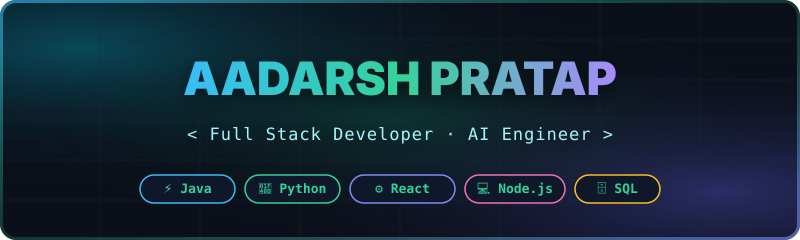

<p align="center">
  
</p>

<p align="center">
  <a href="https://git.io/typing-svg">
    
  </a>
</p>

<p align="center">
  <a href="https://linkedin.com" target="_blank">
    
  </a>
  &nbsp;
  <a href="mailto:aadarshpratap4726@gmail.com">
    
  </a>
  &nbsp;
  
</p>

<br/>

## ⚡ Technical Console

```typescript
interface Developer {
  name: "Aadarsh Pratap";
  role: "Full-Stack & Software Engineer";
  coreStack: ["Java", "Go", "JavaScript", "HTML/CSS", "Node.js", "Python", "SQL"];
  focus: "Web Applications · Database Systems · Data Structures & Algorithms";
  currentlyBuilding: "Full-Stack Web Projects & System Architecture";
  engineeringValues: "Clean Code · Efficient Algorithms · Scalable Software ⚡";
}
```

---

## 🌟 Featured Engineering Projects

| Project | Highlights & Capabilities | Tech Stack | Links |
| :--- | :--- | :--- | :---: |
| 🎵 **[Spotify Clone](https://github.com/shelby457/Spotify-clone-)** | Interactive web music player application featuring custom audio playback controls, responsive UI, and playlist management | HTML5 · CSS3 · JavaScript | [View Code](https://github.com/shelby457/Spotify-clone-) |
| 📷 **[Gesture Control](https://github.com/shelby457/gesture-control)** | Computer vision gesture recognition script powered by OpenCV for real-time webcam feed capturing & processing | Python · OpenCV | [View Code](https://github.com/shelby457/gesture-control) |
| 💳 **[Loan Management System](https://github.com/shelby457/loan_managemnt_)** | Comprehensive financial tracking and loan record management platform with calculated metrics and data persistence | Web Tech · Database | [View Code](https://github.com/shelby457/loan_managemnt_) |
| 📚 **[Library Management System](https://github.com/shelby457/library-management)** | Digital book cataloging and borrowing tracking system built for structured inventory operations | Java / Web Stack | [View Code](https://github.com/shelby457/library-management) |

---

## 🛠️ Technical Ecosystem & Stack

### 💻 Core Languages
<p align="left">
  
  
  
  
  
  
  
  
</p>

### 🧠 Frameworks & Libraries
<p align="left">
  
  
  
</p>

### 🧰 Tools & Infrastructure
<p align="left">
  
  
  
  
  
</p>

<br/>

## 📈 Activity & Metrics

<p align="center">
  
  &nbsp;&nbsp;
  
</p>

<p align="center">
  
</p>

<br/>

<h3 align="center">📊 Contribution Velocity</h3>

<p align="center">
  
</p>

<br/>

---

<p align="center">
  
</p>
